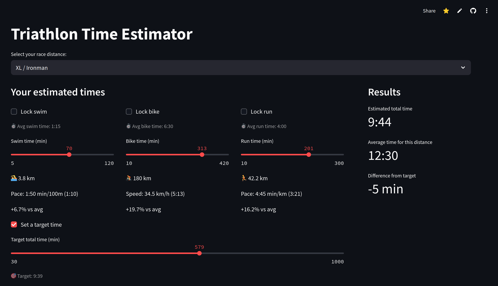

# TriCalc 🏊🚴🏃



**TriCalc** is a simple, interactive Streamlit app that helps triathletes estimate their total race time across all official triathlon distances — from Super Sprint to full Ironman.

## 🧠 Features

- 🔧 Customize your estimated time for each discipline: swim, bike, and run  
- 🔒 Lock one or more sports to fix your best segments  
- 🎯 Set a target race time and see how close you are  
- 📊 Real-time pace/speed indicators:
  - Swim: min/100m  
  - Bike: km/h  
  - Run: min/km  
- 📐 Compare your total time to distance averages

## 📦 Requirements

Only one dependency is needed:
```bash
streamlit
